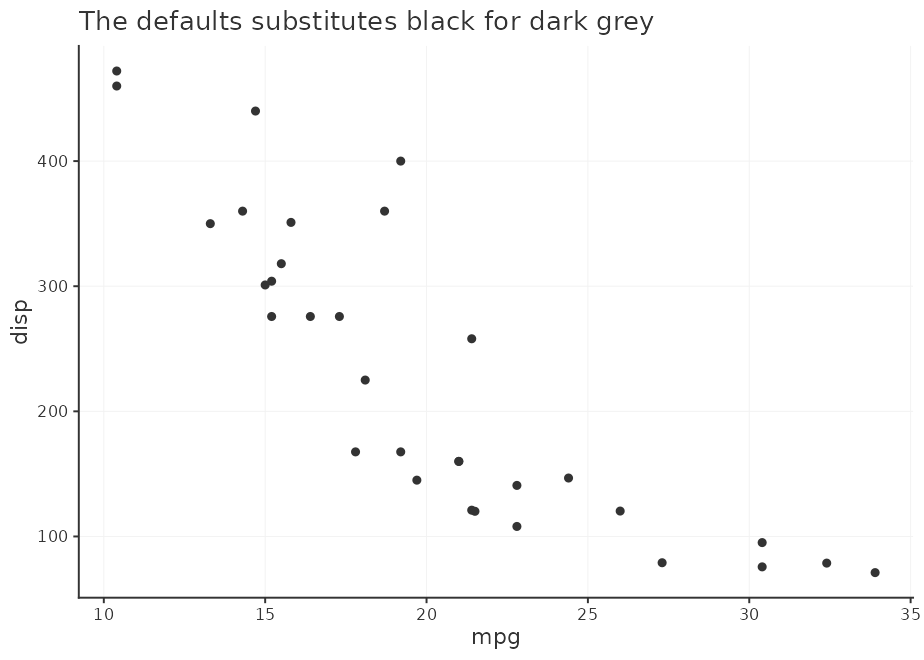
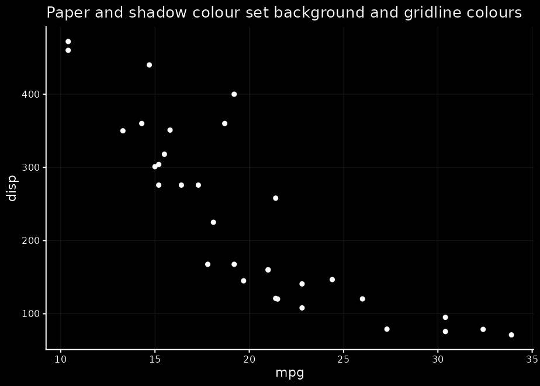

<!-- README.md is generated from README.Rmd. Please edit that file -->

# myplotdefaults

<!-- badges: start -->
<!-- badges: end -->

This is just a repo where I store my plot defaults for the {ggplot2}
package. It is in package format so I wouldn’t need to repeat it for
every script. The theming and such isn’t particularly good, noteworthy
or quirky, it is just to easily replace the default gray theme with yet
another vanilla theme.

## Installation

You can install {myplotdefaults} like so:

``` r
# install.packages("remotes")
remotes::install_github("teunbrand/myplotdefaults")
```

## Example

This is a basic example which shows you how to solve a common problem:

``` r
library(myplotdefaults)
library(ggplot2)
#> Warning: package 'ggplot2' was built under R version 4.1.3

p <- ggplot(mtcars, aes(mpg, disp)) +
  geom_point()

set_defaults()
p + ggtitle("The defaults substitutes black for dark grey")
```



``` r
set_defaults(ink_colour = "blue")
p + ggtitle("Ink colour changes foreground")
```


``` r
set_defaults(ink_colour = "white", paper_colour = "black",
             shadow_colour = "grey10")
p + ggtitle("Paper and shadow colour set background and gridline colours")
```


